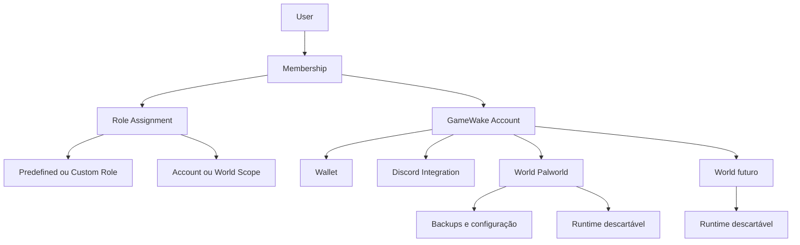
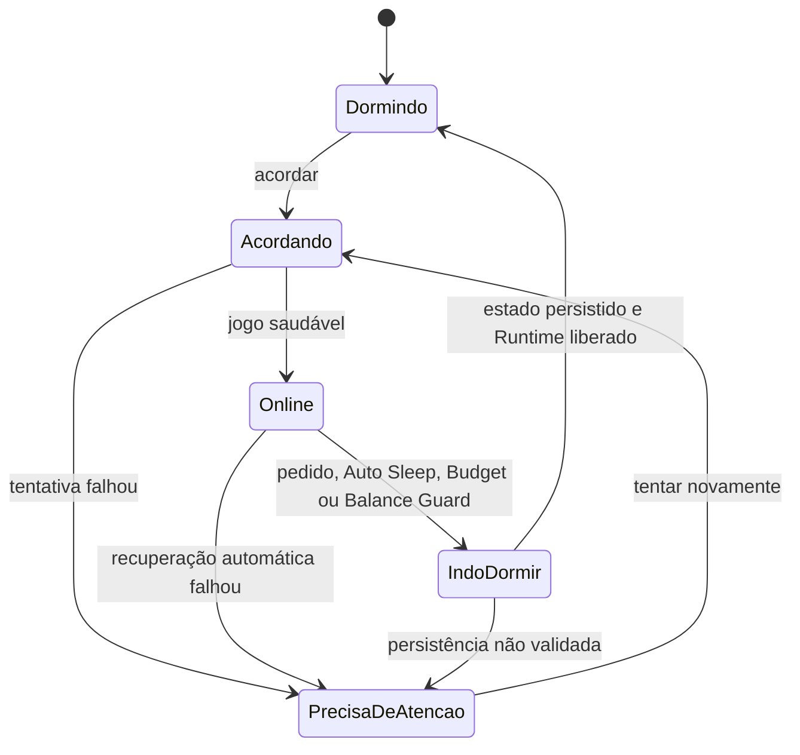
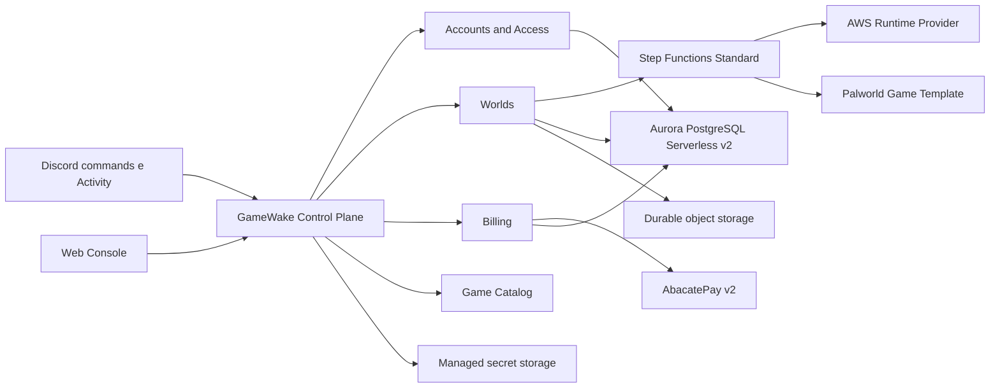

# GameWake Foundation

Status: **decisões de fundação confirmadas em 31 de julho de 2026**.

Este documento consolida a visão, as regras de produto e a direção arquitetural do GameWake. O vocabulário canônico está no [Context Map](../CONTEXT-MAP.md), e decisões estruturais com trade-offs estão em [Architecture Decision Records](./adr/).

## Visão

GameWake permite que um grupo de amigos crie, financie e jogue em mundos persistentes sem escolher provedor, configurar uma conta de nuvem ou manter uma máquina ligada. O grupo entra pelo Discord, acorda o World quando quer jogar e paga apenas pelo uso necessário para executar a sessão.

Proposta de valor:

> Seu mundo continua existindo. A infraestrutura só acorda quando seus amigos querem jogar.

## Princípios do produto

1. **O caso simples permanece simples.** Player, Manager e Owner resolvem o grupo comum; Custom Roles ficam em permissões avançadas.
2. **World não é Runtime.** Progresso, configuração e Backups persistem; a infraestrutura é descartável.
3. **Nenhuma conta-surpresa.** Wallet pré-paga, Usage Reservation, Auto Sleep, World Budget e Balance Guard impedem dívida.
4. **Discord primeiro, Discord apenas quando ajuda.** Slash commands resolvem ações rápidas; a mesma Console oferece os fluxos ricos na Web e como Discord Activity.
5. **Dados pertencem ao grupo.** Backups são verificáveis, a última cópia recuperável nunca é destruída e World Export evita aprisionamento.
6. **Jogos entram por contrato.** Game Templates concentram diferenças de instalação, saúde, acesso, configuração e backup.
7. **A nuvem é problema do GameWake.** O cliente escolhe região, capacidade e preço, não conta AWS ou tipo de instância.
8. **Cobrança é explicável.** Todo saldo deriva de um ledger imutável e toda sessão preserva o preço apresentado no despertar.

## Modelo de recursos

- Um GameWake Account representa o grupo, possui a Wallet e pode possuir vários Worlds.
- Um User pode participar de várias contas por Memberships diferentes.
- No MVP, uma conta conecta-se a um Discord Guild e cada Guild conecta-se a uma conta.
- O Discord oferece interação, mas não possui recursos nem concede acesso automaticamente.
- Role Assignments são aditivos e limitáveis à conta ou a Worlds específicos. Policies concedem acesso; não existe `DENY` explícito.

## Papéis

| Capacidade | Player | Manager | Owner |
|---|:---:|:---:|:---:|
| Ver status, custo e Connection Details | Sim | Sim | Sim |
| Acordar um World | Sim | Sim | Sim |
| Dormir quando estiver vazio | Sim | Sim | Sim |
| Editar configuração e Runtime Profile | Não | Sim | Sim |
| Reiniciar, atualizar e forçar sono | Não | Sim | Sim |
| Consultar logs, criar e restaurar Backups | Não | Sim | Sim |
| Convidar ou remover Memberships | Não | Não | Sim |
| Administrar Roles e integrações | Não | Não | Sim |
| Administrar Wallet e World Budget | Não | Não | Sim |
| Migrar região, exportar ou excluir | Não | Não | Sim |
| Transferir propriedade ou excluir a conta | Não | Não | Sim |

- Novos participantes recebem Player após aceitar o Invitation.
- `/gamewake convidar` usa seleção múltipla, mas cria um Invitation independente por pessoa.
- Todo GameWake Account conserva ao menos um Owner e pode ter vários.
- Custom Roles permitem combinações próprias sem poluir o onboarding comum.
- Sensitive Actions exigem reautenticação recente na Console, confirmação pelo nome do recurso e notificação a todos os Owners.
- Uma conta com apenas um Owner exige e-mail verificado e códigos de recuperação antes do primeiro pagamento.

## Ciclo de vida de um World

### Despertar

1. Autorizar a Membership e resolver o World permitido.
2. Criar um Session Quote com o preço final por hora.
3. Criar uma Usage Reservation para inicialização, pelo menos 15 minutos Online e sono seguro.
4. Iniciar uma World Operation exclusiva e durável.
5. Provisionar o Runtime, restaurar o World e aplicar configuração ou atualização pendente.
6. Considerar o World `Online` apenas após a verificação real do jogo e da conexão.
7. Se nunca alcançar `Online`, aplicar a Wake Guarantee e estornar a tentativa.

Comandos repetidos observam a mesma operação. Eles não criam outro Runtime, reserva ou cobrança. Cada etapa é persistida antes do efeito externo e reconciliada com o provedor após uma interrupção.

### Durante a sessão

- O preço do Session Quote não muda até o fim da sessão.
- Runtime Usage é medido por segundo, com mínimo de 60 segundos e um único arredondamento no total.
- Operation Progress mostra fases reais e estimativa baseada no histórico do jogo e da região.
- Auto Sleep começa em 20 minutos sem jogadores e pode ser configurado para 10, 20, 30 ou 60 minutos, ou desativado com alerta.
- World Budget alerta em 50%, 80% e 100%; no limite, o World dorme e não volta até o orçamento ser alterado ou reiniciado.
- Balance Guard alerta quando restam aproximadamente 30, 10 e 5 minutos e reserva o valor do sono seguro.
- Uma falha de saúde dispara até três tentativas de Automatic Recovery em 15 minutos dentro da mesma sessão.
- Indisponibilidade contínua superior a dois minutos produz Availability Credit até o retorno a `Online`.

### Sono seguro

1. Revalidar jogadores e permissões.
2. Avisar o grupo quando aplicável.
3. Solicitar o save nativo do jogo.
4. Persistir e validar o estado fora do Runtime.
5. Criar o Backup previsto pela política.
6. Liberar a infraestrutura paga.
7. Encerrar Runtime Usage e liberar a parcela não utilizada da Usage Reservation.

O World só chega a `Dormindo` quando a Recovery Guarantee foi satisfeita. Em caso de falha, o GameWake preserva armazenamento recuperável, libera computação apenas quando seguro e mostra `Precisa de atenção`.

## Backups, exportação e exclusão

- Backups automáticos são criados ao dormir, antes de atualização, aplicação de configuração ou restauração e periodicamente conforme o Game Template.
- Backups automáticos usam retenção rotativa; Backups manuais permanecem até remoção e contam na Storage Allowance.
- Restaurar um Backup preserva primeiro o estado atual.
- Restaurar uma Configuration Revision não restaura progresso.
- World Export é gratuito, portátil e inclui saves nativos, configuração efetiva, versões e manifesto necessário para hospedagem externa.
- Excluir um World cria Backup final e inicia sete dias de Pending Deletion sem cobrança; o Owner pode cancelar ou exportar antes da remoção definitiva.
- Registros fiscais e de segurança são separados dos dados de jogo e seguem a retenção legal aplicável.

## Jogos e configurações

O Game Template é o contrato de extensão multi-game. Ele contém:

- instalação e atualização do servidor;
- portas, protocolos e verificação de saúde;
- detecção de jogadores;
- salvamento e desligamento seguros;
- caminhos de progresso e regras de Backup;
- World Access Strategy;
- esquema de configuração com tipo, padrão, recomendação, valores aceitos, impacto, documentação oficial e exigência de reinicialização;
- Runtime Profiles compatíveis e recomendação por quantidade de jogadores.

Um World é criado a partir de um Game Template e não troca de jogo. Palworld é o único template do MVP.

### Configuração

- Discord e Console renderizam o mesmo esquema do Game Template.
- Owner e Manager visualizam o diff antes de aplicar.
- A mudança vale no próximo despertar ou após Backup e reinicialização segura.
- Cada aplicação cria uma Configuration Revision imutável com autor, origem, horário e diff.
- O editor bruto fica em `Avançado`, com validação de sintaxe e alerta de suporte.
- Game Updates usam o canal `Estável`; não interrompem um World Online sem escolha explícita de Owner ou Manager.

### Acesso ao jogo

- Quando o jogo suporta allowlist, o GameWake usa Game Identities vinculadas.
- Quando existe apenas senha compartilhada, o Owner ou Manager escolhe entre uma senha fixa e uma nova senha aleatória a cada despertar. O segredo fica em armazenamento seguro, nunca é revelado no editor e só aparece de forma efêmera nas Connection Details autorizadas.
- Repetir ou retomar o mesmo despertar preserva a senha gerada; somente uma nova sessão efetiva a rotaciona.
- Revogar acesso invalida comandos imediatamente e remove a identidade ou rotaciona o segredo antigo.
- Connection Details nunca aparecem em cards públicos ou Activity Events.

## Wallet e pagamentos

- O MVP opera no Brasil, em `pt-BR`, e cada Wallet usa apenas `BRL`.
- A Wallet é compartilhada pela conta e nunca pode ficar negativa.
- Qualquer Membership pode fazer uma Wallet Contribution com seu próprio meio de pagamento.
- O saldo é derivado de um Wallet Ledger imutável; correções são lançamentos compensatórios.
- AbacatePay API v2 é o Payment Provider do MVP para checkout avulso por Pix e cartão.
- Eventos do provedor são autenticados, deduplicados e reconciliados; o saldo da AbacatePay não é a Wallet.
- O Checkout v2 usa pacotes de crédito em BRL mapeados a produtos avulsos da AbacatePay. O valor retornado e pago deve coincidir exatamente com o pacote antes de qualquer crédito.
- O webhook exige simultaneamente o `webhookSecret` da URL e a assinatura HMAC-SHA256 em Base64 do corpo bruto. Eventos são deduplicados pelo `id` da AbacatePay.
- Apenas o pagador vê seu link de checkout e o resumo do meio de pagamento. O grupo vê somente a movimentação segura da Wallet.
- Reembolso solicitado pelo produto é sempre integral e somente é permitido enquanto todo o crédito daquela contribuição estiver disponível. Reembolso ou disputa externos sem saldo suficiente congelam o saldo disponível em `Needs Review`, sem tornar a Wallet negativa, até a conciliação.
- Auto Recharge fica fora do MVP até existir suporte documentado para cobrança segura sob demanda em um meio salvo.
- A Storage Allowance cobre o grupo comum. Apenas excedente consome créditos por GB/mês.
- Excedente sem saldo inicia 30 dias de Storage Grace Period; depois disso, somente Backups automáticos antigos podem ser podados. Estado atual e Backups manuais nunca são removidos automaticamente.

Referências verificadas da integração: [checkout (configurado em Pix no MVP)](https://docs.abacatepay.com/pages/payment/create), [segurança dos webhooks](https://docs.abacatepay.com/pages/webhooks/security), [eventos de Checkout](https://docs.abacatepay.com/pages/webhooks/events/checkout), [reembolso integral](https://docs.abacatepay.com/pages/payment/refund) e [assinaturas cíclicas](https://docs.abacatepay.com/pages/subscriptions/create).

## Discord e GameWake Console

- A GameWake Console é uma Web UI responsiva acessível pelo navegador e como Discord Activity.
- Slash commands atendem ações rápidas e abrem a Console na tela correta para fluxos ricos.
- Se a Membership alcança um único World, ele é selecionado automaticamente; caso contrário, autocomplete ou seletor mostra apenas Worlds permitidos.
- O GameWake Channel recebe cards não sensíveis de status, custo, jogadores e eventos importantes.
- `/gamewake conectar` responde de forma efêmera com endereço, porta, senha e botões de cópia.
- Administração, pagamentos e segredos são sempre efêmeros ou abertos na Console.
- Activity Events são imutáveis e redigidos na origem. Players veem atividade básica, Managers o histórico operacional e Owners também acesso e finanças.

## Direção arquitetural

A recomendação é começar como **modular monolith** com um worker de orquestração durável, não como uma coleção de microserviços. Os limites do Context Map viram módulos internos e contratos; somente carga, isolamento ou cadência independente justificará separá-los depois.

Responsabilidades:

- **Control Plane API**: autenticação, autorização, comandos, consultas e projeções para as interfaces.
- **Step Functions Standard**: exclusão mútua por World, retomada, reconciliação e execução durável; efeitos externos continuam idempotentes por contrato.
- **Aurora PostgreSQL Serverless v2**: Accounts, Memberships, Roles, Worlds, idempotência, projeções de operações, Activity Events e Wallet Ledger; Data API evita conexões ociosas e versões compatíveis pausam em zero ACUs.
- **Durable object storage**: saves, Backups, exports e artefatos versionados de Game Templates.
- **Managed secret storage**: chaves de provedor, webhooks e segredos de conexão, nunca o banco de atividade.
- **Adapters**: AWS, AbacatePay, Discord e Palworld permanecem nas bordas.

## MVP

Incluído:

- Palworld no Brasil;
- infraestrutura AWS gerenciada;
- Discord sign-in, Guild integration, slash commands e Activity;
- GameWake Console no navegador;
- Account, Invitation, Owner, Manager, Player e Custom Roles;
- Wallet pré-paga com contribuição avulsa por Pix e cartão na AbacatePay;
- medição, reservas e proteções de custo;
- ciclo completo de despertar, conexão, sono, recuperação e observabilidade;
- Backups, World Export, configurações guiadas e Activity Events.

Fora do MVP:

- mods;
- outros jogos;
- aplicativo móvel nativo;
- Auto Recharge;
- pós-pago;
- BYOC ou escolha de provedor;
- múltiplos Runtime Providers;
- canais experimentais de atualização.

## Closed Beta

- 10 a 20 grupos brasileiros convidados.
- 30 dias de uso de Palworld.
- Crédito promocional inicial.
- Ao menos uma contribuição real pela AbacatePay por grupo.
- Canal direto de suporte e feedback.
- Sem SLA público durante a beta.

### Critérios de saída

1. Zero perda irrecuperável de progresso.
2. Zero Wallet negativa e 100% dos pagamentos conciliados em até 24 horas.
3. Pelo menos 95% dos despertares válidos chegam a `Online`.
4. Tempo P95 de despertar inferior a cinco minutos.
5. Pelo menos 80% dos grupos concluem onboarding e primeira sessão sem ajuda humana.
6. Pelo menos 50% dos grupos jogam novamente na quarta semana.
7. Pelo menos 30% fazem outra contribuição depois do crédito inicial.

## Crescimento depois da beta

O crescimento deve ampliar o comportamento validado, não aumentar o catálogo antes da confiabilidade.

1. **Loop de convite**: transformar `/gamewake convidar` e o onboarding do grupo no principal canal orgânico.
2. **Cards compartilháveis**: status e conquistas do World podem levar outros grupos à landing page sem expor Connection Details.
3. **Créditos por indicação**: testar incentivo bilateral apenas depois que fraude, margem e retenção estiverem medidos.
4. **Fila por jogo**: permitir que grupos votem no próximo Game Template e medir demanda antes de construí-lo.
5. **Comunidades e criadores**: pilotos com servidores de Discord focados no jogo e parceiros que já organizam grupos.
6. **Expansão do catálogo**: escolher o segundo jogo por demanda, compatibilidade operacional e margem, não por popularidade isolada.
7. **Mods e presets comunitários**: considerar somente após atualização, Backup, recuperação e suporte do jogo base estarem estáveis.
8. **Internacionalização**: adicionar idioma, moeda, região e Payment Provider como um pacote de mercado, sem misturar moedas em uma Wallet.

## Decisões abertas antes do lançamento público

- evolução do preço da Closed Beta de `R$ 2,49/h`, margem mínima pública e valores de novos Runtime Profiles;
- tamanho da Storage Allowance e retenção automática por jogo;
- política comercial e jurídica de reembolso de créditos não utilizados, disputas, tributos e LGPD;
- regiões AWS do MVP e benchmarks reais de latência, custo e tempo de despertar;
- validação de marca, domínio e disponibilidade jurídica de `GameWake`;
- política pública de SLA depois da Closed Beta;
- suporte futuro da AbacatePay a Auto Recharge sob demanda.

Esses itens são deliberadamente abertos: precisam de benchmarks, pesquisa jurídica ou validação de mercado e não alteram o modelo de domínio confirmado.

O provedor transacional, o workflow e a persistência já estão decididos para o MVP: AbacatePay API v2, Step Functions Standard e Aurora PostgreSQL Serverless v2 via Data API, conforme ADRs 0023 e 0025.
