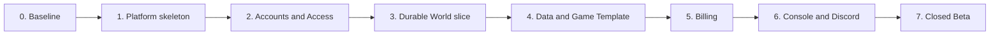

# GameWake Delivery Roadmap

Este roadmap transforma o protótipo Palworld atual no MVP definido na [GameWake Foundation](./GAMEWAKE_FOUNDATION.md). Ele usa marcos e critérios de aceitação, não datas: cronograma depende de equipe, orçamento, benchmarks e decisões técnicas ainda abertas.

## Estratégia

- Entregar fatias verticais que possam ser demonstradas e testadas de ponta a ponta.
- Preservar o servidor Palworld atual como ambiente de referência durante a migração.
- Extrair contratos antes de trocar implementações.
- Começar como modular monolith com um worker durável.
- Não criar microserviços, múltiplos jogos ou múltiplos provedores antes de a Closed Beta provar necessidade.
- Tratar integridade de World e Wallet como gates, nunca como melhorias posteriores.

## Ponto de partida

| Ativo atual | Como será reutilizado | Limite que precisa ser removido |
|---|---|---|
| `lambda/discord_signature.py` | Adapter de autenticação das interações Discord | Discord ID ainda não resolve User e Membership internos |
| `lambda/handler.py` | Referência dos comandos e respostas rápidas | Handler combina interação, autorização e ciclo de uma única EC2 |
| `lambda/config_service.py` | Bootstrap temporário da primeira conta | Allowlist binária não oferece Roles, scopes ou multi-tenancy |
| `lambda/ec2_service.py` | Primeira implementação do AWS Runtime Provider | Controla uma instância fixa e não uma frota de Runtimes descartáveis |
| `shared/palworld_settings_catalog.py` | Base do esquema do Palworld Game Template | Catálogo ainda é específico e não versionado como contrato de jogo |
| `lambda/settings_*` | Referência da configuração guiada no Discord | Estado e fluxo ainda são específicos do bot |
| `server/*.sh` e unidades systemd | Runner do Palworld Game Template | Scripts estão acoplados ao bootstrap Terraform da instância |
| S3 opcional e scripts de Backup | Base para Backup e World Export | O World ainda não tem armazenamento canônico independente do Runtime |
| Terraform e IAM existentes | Baseline de segurança e primeiro ambiente AWS | Stack cria um servidor, não um control plane multi-tenant |
| Testes, Ruff, ShellCheck e Actions | Gate inicial de regressão | Faltam testes de domínio, contratos, ledger, concorrência e E2E da Console |

## Ordem de entrega

Billing começa depois de o ciclo de vida ser confiável porque não devemos cobrar por uma operação que ainda não conseguimos medir, reconciliar ou recuperar.

## Marco 0 — Baseline e identidade do projeto

### Entregas

- Adotar GameWake na documentação, interface e novos módulos sem renomear recursos AWS em produção de forma destrutiva.
- Publicar Context Map, Foundation, ADRs e roadmap como fontes de decisão.
- Inventariar segredos, estado Terraform local e recursos existentes; remover qualquer artefato sensível do histórico antes da expansão.
- Manter o fluxo Palworld atual executável como referência.
- Acrescentar testes que congelem os comportamentos reutilizáveis: assinatura Discord, sono seguro, Backup e renderização de configurações.

### Gate

- Suite atual verde.
- Nenhuma alteração automática de infraestrutura existente.
- Fluxo `/palworld` documentado como protótipo legado e GameWake definido como produto alvo.

## Marco 1 — Platform skeleton

### Entregas

- Criar módulos internos alinhados ao Context Map: Accounts, Worlds, Game Catalog, Billing e Experience.
- Definir IDs internos estáveis e contratos entre módulos.
- Introduzir armazenamento transacional para metadados e ledger.
- Introduzir armazenamento durável de objetos para estado do World, Backups e exports.
- Separar Control Plane API do worker que executa World Operations.
- Definir journal durável, idempotency keys, exclusão mútua por World e reconciliação de efeitos externos.
- Armazenar chaves e segredos em serviço gerenciado separado dos registros de atividade.

### Gate

- Um comando pode ser recebido, persistido, executado pelo worker e observado até o fim.
- Reiniciar API ou worker no meio da operação não duplica o efeito.
- Testes provam isolamento por `GameWakeAccountId` em toda consulta e mutação.

## Marco 2 — Accounts and Access

### Entregas

- Sign-in com Discord criando User interno e Linked Identity.
- Criação de GameWake Account e relação um-para-um com Discord Guild no MVP.
- Invitation individual e em lote com aceitação explícita.
- Memberships, Resource Scopes, Policies allow-only e Role Assignments aditivos.
- Owner, Manager e Player predefinidos; editor avançado de Custom Roles.
- Proteção do último Owner, Owner Recovery e confirmação de Sensitive Actions.
- Access Revocation e Activity Events redigidos.

### Gate

- Matriz completa de autorização testada por ação, Role, Account e World Scope.
- Um User de outra conta nunca observa ou altera recursos alheios.
- Revogar acesso bloqueia imediatamente APIs e produz Activity Event sem segredo.
- Perder a única Linked Identity tem caminho de recuperação testável sem override do suporte.

## Marco 3 — Durable World slice

### Entregas

- Modelar World, World Status, World Operation e Operation Progress.
- Envolver `EC2Service` no contrato AWS Runtime Provider antes de substituir seu comportamento.
- Implementar despertar idempotente com fases observáveis e verificação real de saúde.
- Implementar sono seguro, Auto Sleep e limites de repetição.
- Implementar Automatic Recovery com três tentativas em 15 minutos.
- Expor o primeiro fluxo end-to-end para um World Palworld sem cobrança real.
- Migrar em duas etapas: primeiro operar a EC2 existente pelo novo contrato; depois criar e destruir Runtimes com estado persistente externo.

### Gate

- Dez comandos concorrentes de despertar criam exatamente um Runtime.
- Falha após qualquer etapa pode ser retomada ou termina em `Precisa de atenção` sem duplicação.
- `Online` significa que o jogo aceita conexão, não apenas que a EC2 está `running`.
- O Runtime pode ser destruído e recriado sem alterar a identidade do World.

## Marco 4 — Palworld Game Template e segurança dos dados

### Entregas

- Extrair instalação, atualização, saúde, jogadores, save, shutdown, caminhos e acesso para o Palworld Game Template.
- Transformar o catálogo atual em esquema versionado de World Configuration.
- Renderizar o mesmo esquema no Discord e na futura Console.
- Criar Configuration Revisions imutáveis e rollback independente de progresso.
- Tornar o armazenamento externo a cópia canônica do estado do World.
- Implementar política de Backup, restauração que preserva o estado atual e Recovery Guarantee.
- Implementar World Export portátil e Pending Deletion de sete dias.
- Implementar Storage Allowance, medição e Storage Grace Period.

### Gate

- Exercício automatizado cria World, joga um fixture, dorme, destrói Runtime, recria e valida o fixture.
- Restaurar Backup sempre cria um ponto de retorno.
- Export produzido pode ser restaurado em uma instalação Palworld fora do GameWake.
- Nenhum caminho de falha destrói a última cópia recuperável.
- Discord e Console produzem a mesma configuração efetiva para o mesmo input.

## Marco 5 — Billing e AbacatePay

### Entregas

- Wallet em BRL derivada de Wallet Ledger append-only.
- Wallet Contributions avulsas por checkout Pix e cartão da AbacatePay API v2.
- Endpoint de webhook com verificação HMAC, deduplicação por evento e reconciliação.
- Tratamento explícito de pagamento concluído, reembolsado e disputado.
- Session Quote, Usage Reservation e Runtime Usage medido por segundo.
- Runtime Charge com mínimo de 60 segundos e arredondamento único.
- Wake Guarantee e Availability Credit como lançamentos compensatórios.
- World Budget e Balance Guard com sono seguro.
- Extrato compreensível para o grupo e visão privada do meio de pagamento para o pagador.

### Gate

- Testes de propriedade garantem que a Wallet nunca fica negativa.
- Reprocessar qualquer webhook ou mensagem não duplica crédito ou débito.
- A soma do ledger reconcilia com pagamentos e uso em até 24 horas.
- Despertares concorrentes não reservam mais do que o saldo disponível.
- Falha antes de `Online` e indisponibilidade confirmada produzem exatamente os créditos previstos.
- Auto Recharge não aparece como recurso disponível no MVP.

## Marco 6 — GameWake Console e Discord

### Entregas

- Web UI responsiva com onboarding, Worlds, Wallet, membros, Roles, configurações, Backups e atividade.
- Empacotar a mesma Console como Discord Activity.
- Slash commands `/gamewake` para convidar, status, acordar, conectar, dormir e abrir a Console.
- Seleção automática de World quando não há ambiguidade e seletor filtrado quando há vários.
- GameWake Channel com cards não sensíveis e respostas administrativas efêmeras.
- Connection Details privados com ações de cópia.
- Progresso em tempo real e notificação de sucesso ou atenção.
- Landing page centrada em “seu mundo persiste; a infraestrutura só acorda para jogar”.

### Gate

- E2E cobre onboarding, convite, contribuição, despertar, conexão, configuração e sono.
- Os mesmos fluxos funcionam no navegador e dentro do Discord.
- Nenhuma senha, chave, cartão ou token aparece em card, Activity Event ou telemetria.
- Pelo menos 80% dos usuários de teste completam a primeira sessão sem orientação humana.

## Marco 7 — Closed Beta

### Entregas

- Selecionar 10 a 20 grupos brasileiros e preparar suporte direto.
- Distribuir créditos promocionais e processar uma contribuição real por grupo.
- Dashboards de despertar, tempo até Online, recuperação, perda de dados, reconciliação, custo e retenção.
- Runbooks para indisponibilidade, falha de pagamento, operação presa, exportação e recuperação de Owner.
- Exercícios de restauração e reconciliação antes de admitir o primeiro grupo.
- Revisão de segurança, privacidade, termos, tributos, política de reembolso e resposta a incidentes.

### Gate para lançamento público

- Zero perda irrecuperável de progresso.
- Zero Wallet negativa e 100% dos pagamentos conciliados em até 24 horas.
- Pelo menos 95% dos despertares válidos chegam a `Online`.
- P95 de despertar inferior a cinco minutos.
- Pelo menos 80% dos grupos concluem onboarding e primeira sessão sem ajuda.
- Pelo menos 50% dos grupos voltam na quarta semana.
- Pelo menos 30% fazem nova contribuição depois do crédito inicial.

## Estratégia de testes

| Camada | Evidência necessária |
|---|---|
| Domínio | invariantes de último Owner, Policies, Wallet, Budget e estados do World |
| Contratos | suites comuns para Runtime Provider, Payment Provider e Game Template |
| Concorrência | despertares, webhooks e comandos repetidos não duplicam efeitos |
| Recuperação | falhas injetadas após cada etapa retomam ou entram em atenção com segurança |
| Dados | Backup, restore, export e destruição de Runtime preservam fixtures reais |
| Segurança | isolamento multi-tenant, redaction, assinatura Discord, HMAC e step-up auth |
| E2E | navegador e Discord percorrem o mesmo caso completo |
| Operação | restore drills, reconciliação diária e runbooks executados antes da beta |

O `make validate` atual continua como gate enquanto novos comandos de contrato, integração e E2E são adicionados progressivamente.

## Spikes obrigatórios

Estes estudos precisam produzir decisão e evidência antes do marco correspondente:

1. Banco transacional e mecanismo de workflow durável adequados ao orçamento e à operação da equipe.
2. Custo e tempo de criar Runtimes descartáveis por região e Runtime Profile.
3. Estratégia canônica de volumes e S3 que satisfaça Recovery Guarantee sem computação ociosa.
4. Semântica completa de reembolso, disputa e conciliação da AbacatePay.
5. Empacotamento e restrições da GameWake Console como Discord Activity.
6. Valores reais da Storage Allowance, retenção e preços de varejo.
7. Validação jurídica de marca, LGPD, termos, tributação e créditos pré-pagos.

## Depois do MVP

Somente depois dos gates da Closed Beta:

1. Escolher o segundo Game Template por demanda medida e compatibilidade operacional.
2. Testar indicação com créditos e parcerias com comunidades de Discord.
3. Considerar mods e presets comunitários com isolamento e rollback.
4. Adicionar outro mercado como pacote completo de idioma, moeda, região e Payment Provider.
5. Adicionar outro Runtime Provider apenas quando custo, capacidade ou resiliência justificarem.
